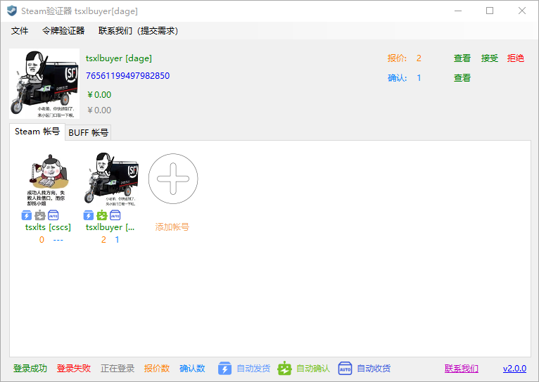
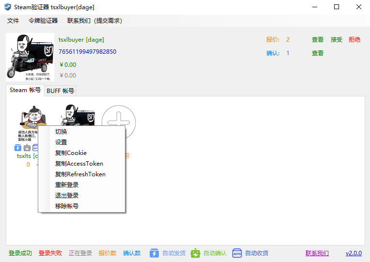
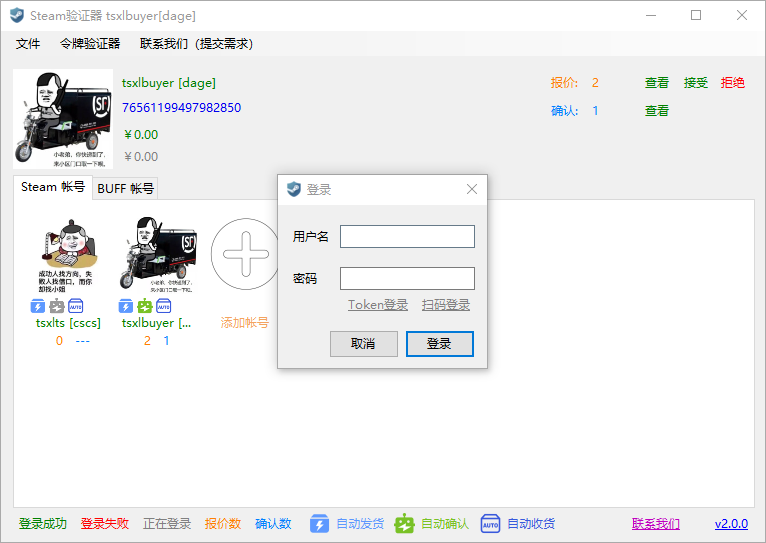
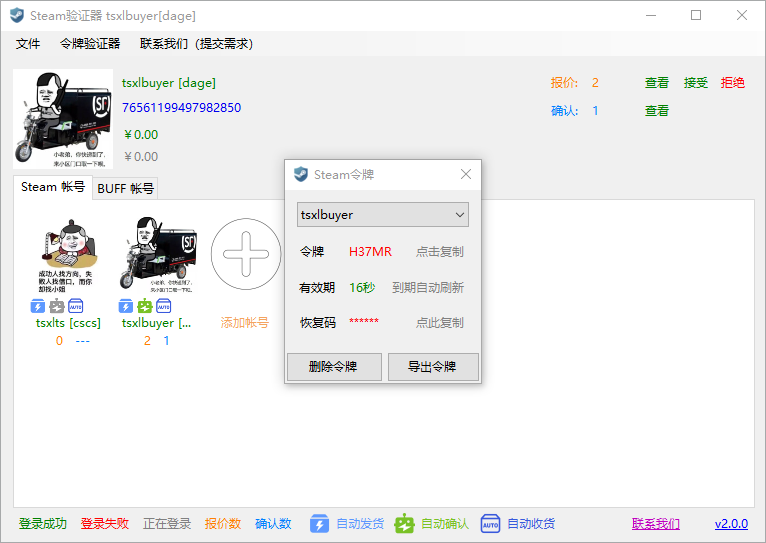
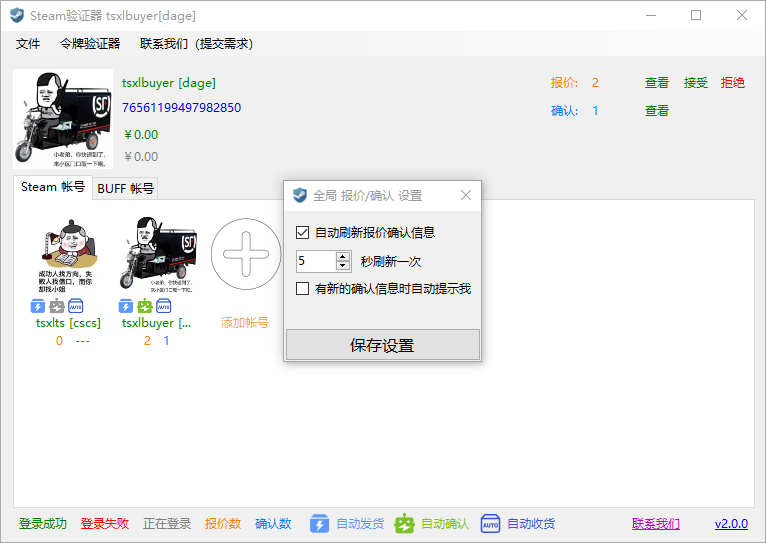
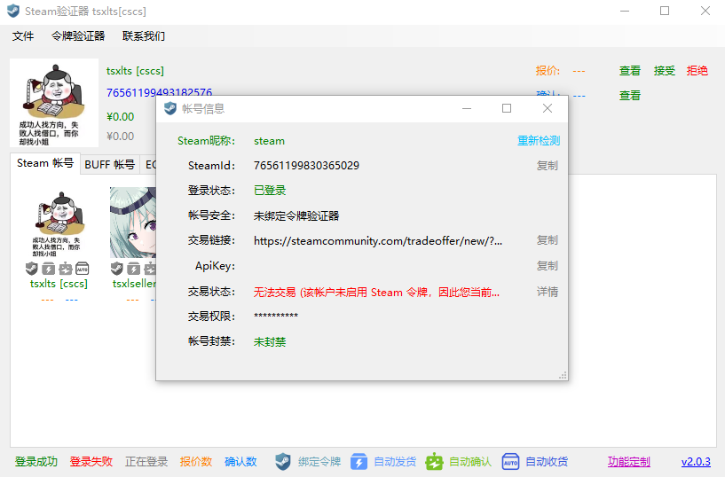

# SteamAuthenticator
## Steam身份验证器 Steam桌面令牌
### Steam自动发货工具 Steam自动收货工具
### BUFF、ECOSteam、悠悠有品自动发货工具

  
<strong>官方服务群：1030346616（QQ群）</strong>

  
<strong>联系方式：2570096963（QQ）</strong>

  
<strong>扫描下方二维码加入官方服务群</strong>

  

  
1、支持无15天交易限制转移令牌！！！

  
2、支持自动确认交易报价和市场上架

  
3、支持自动接受报价，无需绑定令牌，可单独配置自动接受收货报价和发货报价

  
4、支持导入导出令牌

  
5、支持多账号管理

  
6、支持扫码登录

  
7、支持添加BUFF帐号，自动处理BUFF报价

  
8、支持添加ECO帐号，自动处理ECO报价

  
9、支持添加悠悠有品帐号，自动处理悠悠有品报价

  
10、支持自定义接受报价和令牌确认规则，自动处理指定规则的报价

  
11、支持查看交易链接、Apikey等帐户信息

  
12、支持Steam帐号状态检测，交易限制、交易暂挂、VAC封禁等

  
<strong>账号安全性？</strong>

  
<strong>SteamAuthenticator项目的所有源代码均开放托管在GitHub上，可供所有人查看和审查代码安全性。</strong>

  
<strong>本程序在运行过程中所使用的Steam帐号信息、Steam帐号登录信息、Steam令牌信息和第三方平台帐号信息等用户数据均保存在你运行本程序所使用的计算机上。在你使用的电脑不被恶意软件、用户入侵的情况下，账号数据不可能泄露。</strong>

  

 
 
 
 
 
 
 
 
 
 
 
 
 
 
 
 
 
 
 

